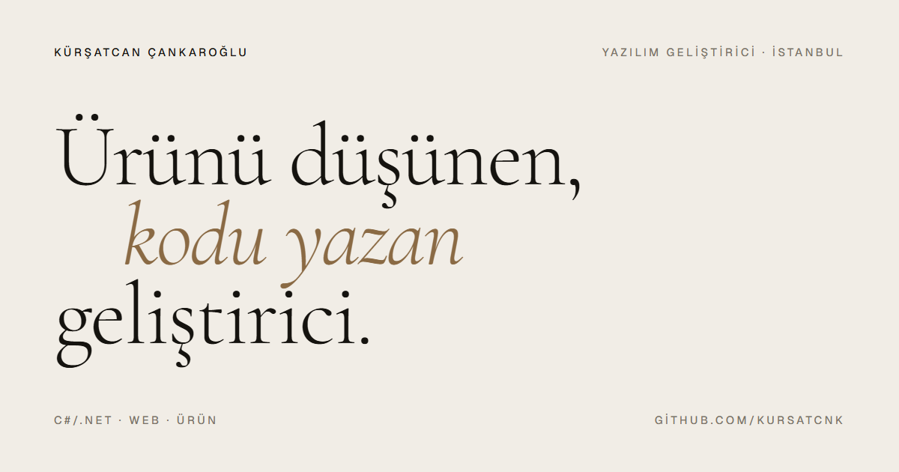

# Kürşatcan Çankaroğlu — Portfolyo

Kişisel sitem: seçili işler, vaka çalışmaları, hizmetler, yazılar ve iletişim. Hem iş görüşmeleri hem freelance projeler için tek adres.

Framework ve hazır tema kullanmadan; HTML, tek bir CSS dosyası ve birkaç küçük JavaScript dosyasıyla yazıldı. Build adımı yok, klasör olduğu gibi yayına alınıyor.



## Öne çıkanlar

- **Gerçek ekranlar.** PromptForge, OnPixel / Cards Rumble ve ESN Görev Takip vaka çalışmalarındaki görseller, demo verisiyle çalışan gerçek sürümlerden alındı.
- **Brief stüdyosu.** İletişim sayfasında ziyaretçi proje türünü, ihtiyaçları ve öncelik sırasını seçiyor; sayfa netlik puanı, yol haritası, riskler ve hazır bir e-posta taslağı çıkarıyor. Gönderim backend gerektirmiyor.
- **Lüks, sinematik dil.** Krem zemin ve ince Cormorant başlıklar; kaydırdıkça çerçeveden tam ekrana açılan ürün vitrini, bir öncekinin üzerine kayan tam ekran iş sahneleri, oturumda bir kez görünen açılış sayacı ve zarif imleç. Hareketler, hareket azaltma tercihine uyuyor.
- **Krem (açık) tema varsayılan**, koyu tema isteğe bağlı ve hatırlanıyor.
- **Hafif.** Fontlar siteyle birlikte geliyor, üçüncü taraf istek yok (iletişim sayfasındaki isteğe bağlı EmailJS hariç). Görseller WebP.
- **Sıkı CSP** ve güvenlik başlıkları (`_headers`, `netlify.toml`, `vercel.json`, `.htaccess`).

## Yapı

```
index.html                 ana sayfa
portfolio.html             tüm işler
portfolio-details.html     vaka çalışması (?p=promptforge)
service.html               hizmetler, süreç, paketler
about.html                 deneyim, eğitim, yetkinlikler, sertifikalar
certificates.html          sertifika arşivi (arama, filtre, ID kopyalama)
news.html                  yazılar
news-details.html          yazı (?slug=...)
faq.html                   sık sorulanlar
contact.html               brief stüdyosu ve iletişim formu
404.html

assets/css/kursat.css            tüm stiller
assets/js/kursat-theme.js        tema, ilk boyamadan önce
assets/js/kursat-core.js         menü, tema düğmesi, saat, geçişler, kopyalama
assets/js/kursat-content.js      işler, yazılar, sertifikalar, SSS, senaryolar
assets/js/kursat-studio.js       brief stüdyosu ve iletişim formu
assets/js/kursat-projects.js     proje verisi
assets/js/kursat-posts.js        yazı verisi
assets/js/kursat-certificates.js sertifika verisi
assets/media/                    ekran görüntüleri, portre, marka görselleri
assets/fonts/                    Cormorant Garamond, Geist, Geist Mono (OFL)
```

Tüm sınıf, ID, data özniteliği ve dosya adları `kursat-` önekiyle yazıldı.

## İçerik güncelleme

- **Yeni proje:** `assets/js/kursat-projects.js` içine bir nesne ekle. `featured: true` olursa ana sayfada büyük vaka çalışması olarak, değilse arşiv listesinde görünür. Görselleri `assets/media/work/<slug>/` altına koy.
- **Yeni yazı:** `assets/js/kursat-posts.js` içine ekle; en yeni tarihli yazılar ana sayfada otomatik listelenir.
- **Yeni sertifika:** `assets/js/kursat-certificates.js`.
- **Üst menü / alt bilgi:** her sayfada `<!-- kursat:header -->` ve `<!-- kursat:footer -->` blokları aynı; birini değiştirdiysen diğer sayfalara da aynen kopyala.

## E-posta gönderimi

Brief stüdyosu ve iletişim formu sırasıyla şunları dener:

1. **EmailJS:** `contact.html` içindeki `data-kursat-emailjs-public`, `-service`, `-template` değerlerine gerçek anahtarlar girilirse direkt gönderir.
2. **FormSubmit:** anahtar yoksa (varsayılan) formu `formsubmit.co/info.cankaroglu@gmail.com` adresine gönderir. FormSubmit ilk gönderimde alıcı adrese bir **aktivasyon e-postası** yollar; bir kez onaylamak yeterli.
3. **Gmail taslağı:** ikisi de olmazsa aynı içerikle Gmail yazma ekranını açar.

## Yerelde çalıştırma

Herhangi bir statik sunucu yeterli:

```bash
npx serve .
```

ya da VS Code'da Live Server. Dosyayı doğrudan çift tıklayarak açınca da çalışır; form o durumda yeni sekmede gönderilir.

## Yayına alma

`docs/DEPLOY.md` dosyasında Netlify, Vercel ve Cloudflare Pages adımları var. Build komutu yok, yayın klasörü kök dizin.

## Lisans

Kod ve içerik Kürşatcan Çankaroğlu'na aittir. Fontlar SIL Open Font License 1.1 ile dağıtılır (`assets/fonts/LICENSE-*.txt`).
